# STM32 -- REG -- BASIC
Cách học: 
👌 Bước 01: Config toàn bộ lại thanh ghi 
👌 Bước 02: Cần dùng gì thì tìm hiểu cái đó

⚠️ Kiến thức là vô hạn vì vậy nếu thấy vấn đề sai sót hoặc không đúng lắm hãy liên hệ mình để sửa lại để tạo một cộng đồng clean code.
```
-----------------------------------
| CHƯƠNG    | NỘI DUNG            |
-----------------------------------
| CHƯƠNG 00 | GIỚI THIỆU          |
| CHƯƠNG 01 | TÀI LIỆU            |
| CHƯƠNG 02 | RCC                 |
| CHƯƠNG 03 | GPIO                |
| CHƯƠNG 04 | AFIO                |
| CHƯƠNG 05 | EXTI                |
| CHƯƠNG 06 | ADC                 |
| CHƯƠNG 07 | TIMER               |
| CHƯƠNG 08 | PWM                 |
| CHƯƠNG 09 | UART                |
| CHƯƠNG 10 | I2C                 |
| CHƯƠNG 11 | SPI                 |
----------------------------------- 
```


## Chương 00: MỘT SỐ KIẾN THỨC CẦN HỌC KHI HỌC VỀ THANH GHI

Có rất nhiều kiến trúc ở thời điểm hiện tại
- ARM   STM     
- 8051  AT89S52 
- AVR   ATMEGA  
- PIC   PIC8 PIC32
- RISC  ESP32 (Dual core)
........ Rất nhiều kiến trúc .........

STM32 là core ARM Cortex-M3

### Set bit lên 1
Cái gì hoặc với 1 cũng bằng 1
```cpp
register |= (1 << 3);  // Đặt bit thứ 3 lên 1
```
### Clear bit
Cái gì và với 0 cũng bằng 0
```cpp
register &= ~(1 << 3);  // Đặt bit thứ 3 về 0
```
### Union
- Tiết kiệm bộ nhớ
- Dễ dàng quản lý
Ví dụ
```cpp
typedef union{
    uint8_t REG;
    struct{
        uint8_t BIT0: 1;
        uint8_t BIT1: 1;
        uint8_t BIT2: 1;
        uint8_t BIT3: 1;
        uint8_t BIT4: 1;
        uint8_t BIT5: 1;
        uint8_t BIT6: 1;
        uint8_t BIT7: 1;
    }BITS;
}__BIT8;

__BIT8 myData;

```
Lúc này thì myData sẽ là một đối tượng gồm có REG và BITS
Lúc này thì khi bạn đổi dữ liệu bất kỳ BIT nào thì biến REG cũng sẽ thay đổi bởi lẽ bản chất thì cả REG và BITS đều trỏ vào vị trí đầu tiên chính là BIO0 --> Đây là cơ chế union

### Define con trỏ chọn đến địa chỉ bất kì
Ví dụ vi điều khiển có GPIOA được đặt với địa chỉ là 0x12345678
GPIOA với kiểu dữ liệu là GPIO_Typedef mà mình muốn variable GPIOA của mình tự định nghĩa ra mapping được với địa chỉ kia thì làm như sau:
```cpp
#define GPIOA     ((volatile GPIO_TypeDef*) 0x12345678)
```
Khi bạn làm việc với phần cứng hoặc các tài nguyên mà giá trị của chúng có thể thay đổi ngoài tầm kiểm soát của chương trình (như thanh ghi của vi điều khiển,...) khi đó thì compiler có thể tối ưu hóa biến này đi

volatile ở đây là để compiler xác định nó là biến có thể bị thay đổi bất cứ lúc nào và không clear nó đi
## Chương 01: TÀI LIỆU VÀ KIẾN THỨC BASE

### PHẦN MỀM

- Keilc v5 ARM   
Link: https://www.keil.com/download/
- Datasheet STM32F1 
Link: https://www.st.com/resource/en/datasheet/cd00161566.pdf 
- STM32F1 reference manual
Link: https://www.st.com/resource/en/reference_manual/rm0008-stm32f101xx-stm32f102xx-stm32f103xx-stm32f105xx-and-stm32f107xx-advanced-armbased-32bit-mcus-stmicroelectronics.pdf 


### PHẦN CỨNG

- STM32F103C8T6 Kit
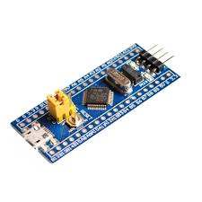  

- STLink V2 (Cài cả driver cho stlink)
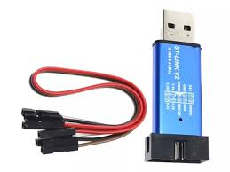  

### MEMORY MAP

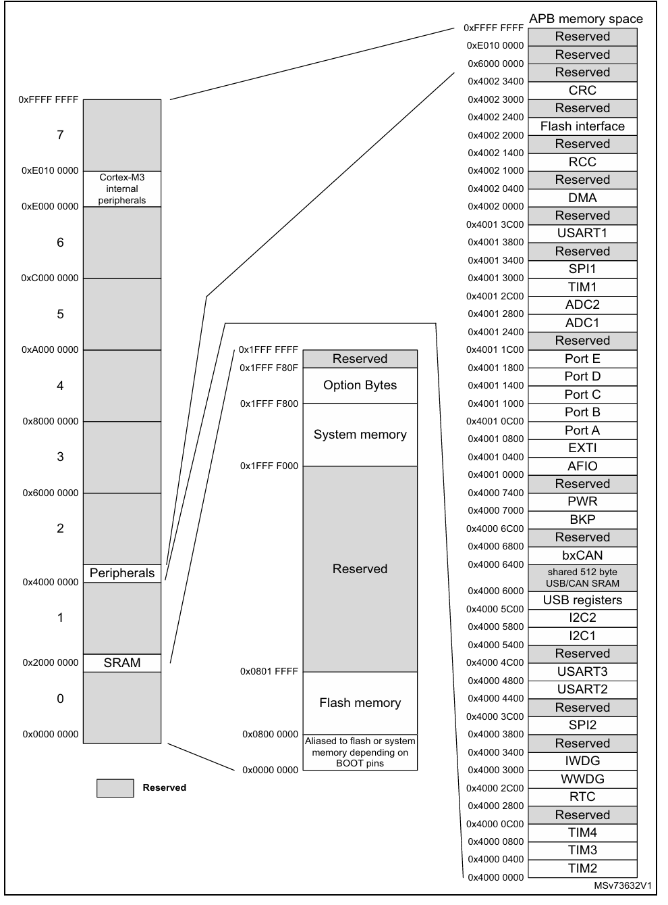

### ADDRESS BASE VÀ OFFSET

Một ví dụ nhỏ:

ADD BASE

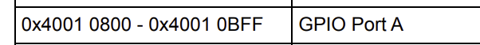

ADDRESS OFFSET


```cpp
Địa chỉ thực tế = Địa chỉ base + Địa chỉ offet

Ví dụ muốn lấy ra thanh ghi CRH của GPIOA

-> Địa chỉ là:

0x4001 0800 + 0x04 = 0x4001 0804

```

## Buổi 01: thử blink led với thanh ghi basic
```cpp
#include <stdio.h>
#include <stdint.h>

//----------RCC-----------------------------
#define RCC_ADD_BASE  0x40021000UL
#define RCC_ADD_APB2ENR   (RCC_ADD_BASE + 0x18)
#define APB2ENR    (*((volatile uint32_t*)RCC_ADD_APB2ENR))


//----------GPIO----------------------------
#define GPIOA_ADD_BASE  0x40010800UL
#define GPIOA_ADD_CRH				(GPIOA_ADD_BASE + 0x00)
#define GPIOA_ADD_ODR				(GPIOA_ADD_BASE + 0x0C)
#define GPIOACRH   (*((volatile uint32_t*)GPIOA_ADD_CRH))
#define GPIOODR    (*((volatile uint32_t*)GPIOA_ADD_ODR))

void mDelay(uint32_t time);
void mDelay(volatile uint32_t time){
	while(time--);
}

int main(){
	
//Config RCC and GPIO A OUTPUT PUSH PULL
	APB2ENR = 0x00000004;
	GPIOACRH = 0x00000003;
	while(1){
		GPIOODR |= (1 << 0);
		mDelay(10000000);
		GPIOODR &= ~(1 << 0); 
		mDelay(10000000);
	}
}


```

## Chương 02: RCC

😒 Mục tiêu:
+ Đưa clock lên tối đa 72Mhz
+ Bật clock cho các GPIO

### 1. Giới thiệu

Clock là một phần quan trọng của vi điều khiển. Bất kì 1 ngoại vi nào cũng cần clock  để hoạt động.

⚠️ Chú ý
```
- Khi có thạch anh ngoài thì tốc độ tối đa sẽ là 72Mhz. ( Thạch anh ngoại )
- Khi không có thạch anh ngoài thì tốc độ tối đa sẽ là 64Mhz. ( Thạch anh nội )
- Tốc độ mặc định sẽ là 8Mhz nếu không cấu hình gì.
```

### 2. Cách config sysclock lên tối đa 72Mhz
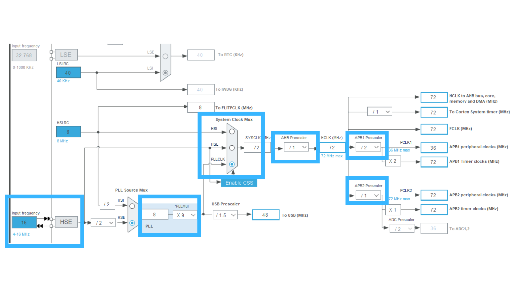

Các bước config lên 72 Mhz
```cpp
         Bước 01: Enable HSE
	 Bước 02: Config Flash 
	 Bước 03: PLL x9	
	 Bước 04: Div clock
	 Bước 05: PLL as SysClk
```

### 3. Các thanh ghi để config sysclock lên 72Mhz
#### 🎁 Thanh ghi CR


```cpp
bit 16: Cấu hình system hoạt động theo HSE
bit 17: Đợi cho HSE hoạt dộng 
bit 24: Cấu hình theo PLL
bit 25: Đợi cho PLL hoạt động 
```

#### 🎁 Thanh ghi CFGR
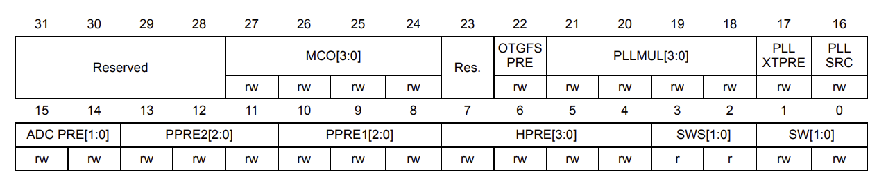

```cpp
PLLSRC: Chọn src cho PLL
PLLMUL[3:0]: Bộ nhân tần
PPRE2[2:0] : Bộ chia tần APB2
PPRE1[2:0] : Bộ chia tần APB1
HPRE[3:0]  : Bộ chia tần HPRE
SW: Chọn clock cho system
SWS: Chờ cho quá trình SW hoàn thành
```

⚠️⚠️⚠️ Lưu ý: Nếu bạn chỉ làm điều này thì sau khi làm xong thì system của bạn vẫn không thể lên được 72Mhz

Bản thân trong vi điều khiên có một khái niệm flash
Khi bạn chọn SYSCLK chạy ở 72 MHz, điều này ảnh hưởng đến tốc độ của nhiều thành phần trong hệ thống, bao gồm tốc độ truy xuất bộ nhớ Flash 
--> Chính vì vậy chúng ta cần config trong 1 thanh ghi nữa về FLASH (FLASH_ACR)

#### 🎁 Thanh ghi FLASH_ACR
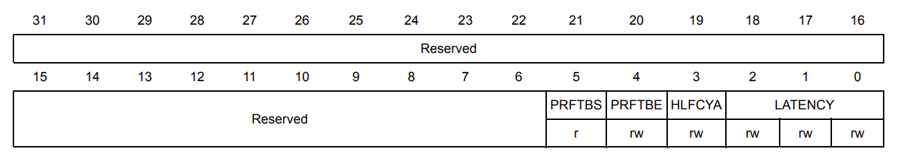

```cpp
Bits 2:0 LATENCY: Latency
000 Zero wait state, if 0 <= SYSCLK <= 24 MHz
001 One wait state, if 24 MHz < SYSCLK <= 48 MHz
010 Two wait states, if 48 MHz < SYSCLK <= 72 MHz

```
### 4. Bật clock của các ngoại vi

#### APB2
Ví dụ các bạn cần bật Clock của GPIOA thì cần đến thanh ghi này
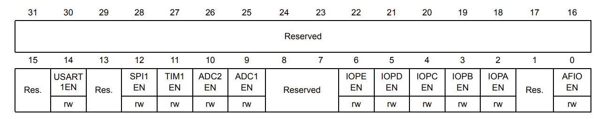
Đơn giản chỉ cần bật bit IOPA = 1 là được

## Chương 03: GPIO

😒 Mục tiêu:
+ Xác thực tính đúng đắn của RCC
+ Blink Led

GPIO bản chất là vào ra tín hiệu
Để blink led, đầu tiên chúng ta cần chọn ra một chân cắm vào led VD PA0 và thực hiện các lệnh sau
```cpp

Bước 01: Bật clk của PORTA (RCC bài trước)
Bước 02: Config Output, Input, PullUp, PullDown, PushPull, OpenDrain
Bước 03: Xuất tín hiệu điện áp mức HIGH, LOW để blink led

```

### 1 Một vài thanh ghi
#### 1.1 🎁 Thanh ghi CRL

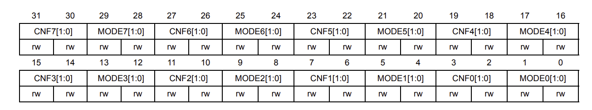

Thanh ghi CRL dùng để cấu hình IO, các Mode cho các Pin từ 0 đến 7

#### 1.2 🎁 Thanh ghi CRH

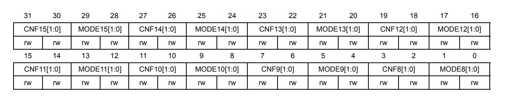

Thanh ghi CRH dùng để cấu hình IO, các Mode cho các Pin từ 8 đến 15

#### 1.3 🎁 Thanh ghi ODR

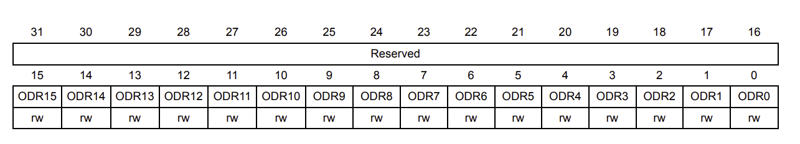

Thanh ghi dùng để xuất tín hiệu ra chân Pin

## Chương 03: AFIO

Alternate Functions - Nó cung cấp các chức năng thay thế cho các chân GPIO như
- UART, SPI, I2C, EXTI,...

Mở datasheet STM32F1 ta có thể thấy bảng sau:
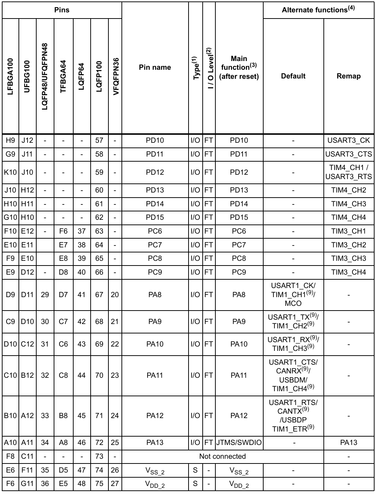

Các alternate function là những chức năng thay thế chân
Bình thường chúng ta sẽ không hay sử dụng những chức năng thay thế này mà thường sẽ dùng mặc định các chân có hỗ trợ sẵn luôn cho tiện

```cpp
    Ví dụ có thể thấy tại PA13 mặc định sẽ là chân SWDIO
    Các bạn có thấy chân này quen không?
    Bản chất chân này được nối khi bạn dùng để debug hoặc nạp code với STLink
    Vì vậy tại chân này nếu muốn dùng GPIO PA13 thì phải dùng AFIO
    Tuy nhiên thì ít ai lại sử dụng như vậy và thường sẽ xử lý giải pháp như sau
    + Dùng 1 chân GPIO khác chưa sử dụng
    + Nếu cần thêm nhiều chân để đọc dữ liệu thì sử dụng module khác sau đó dùng các giao thức để truyền nhận giữa các module
```

⚠️ Tuy nhiên chúng ta vẫn viết driver của AFIO ra để lúc sau nếu cần gì thì chúng ta vẫn sẽ sử dụng

## Chương 04 INTERUPT

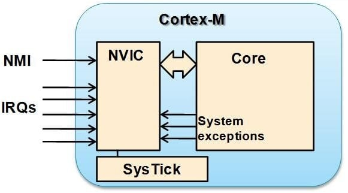

Bản chất trong core chúng ta sẽ tồn tại một thứ gọi là NVIC

Sau đó thì bất cứ interupt (ngắt) nào cũng sẽ đi qua NVIC này
Nó giúp core detect được đây là thể loại ngắt gì (GPIO interrupt, I2C interrupt, UART interrupt,...) và thực thi function interrupt đó.

## I. Nested vectored interrupt controller (NVIC)

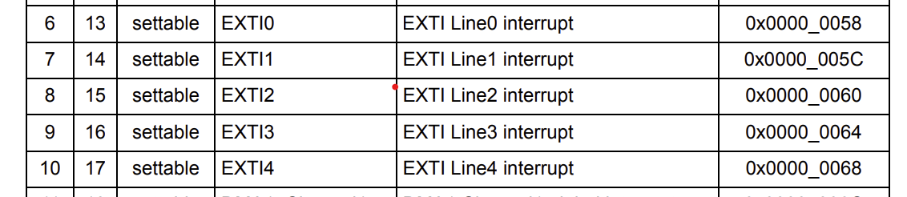

## II. EXTI registers
### 1. Interrupt mask register EXTI_IMR

Các line ngắt
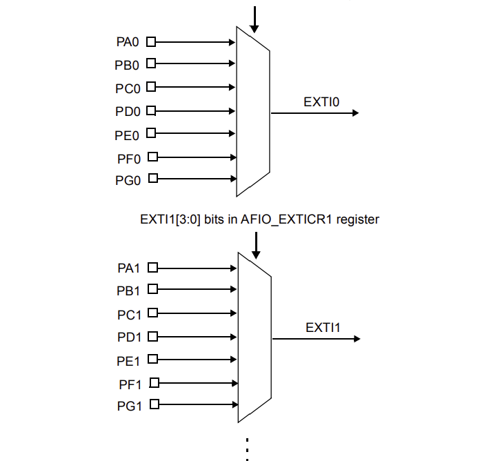

Address offset: 0x00
Reset value: 0x0000 0000
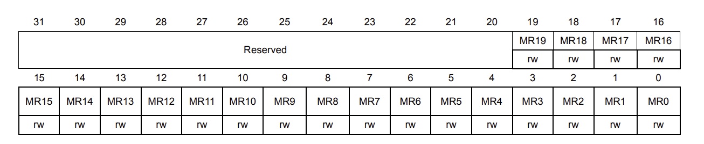
Dùng để bật ngắt line, dùng line ngắt nào thì phải bật line ngắt đó lên
VD: Muốn dùng ngắt ngoài chân PA0 thì phải set bit thứ 0 lên 1
```cpp
MR0 = 1
```
### 2. Rising trigger selection register EXTI_RTSR
Dùng cho mode Rising
Address offset: 0x08
Reset value: 0x0000 0000

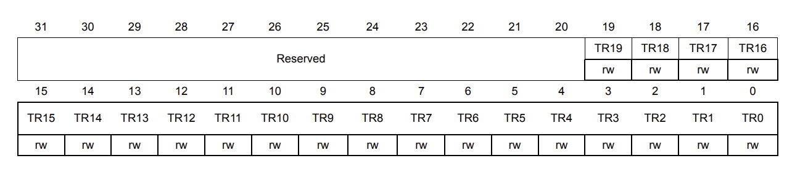
Dùng để bật mode Rising cho line bất kỳ
VD: Muốn dùng ngắt Rising cho line 0 thì phải set bit thứ 0 lên 1
```cpp
TR0 = 1
```
### 3. Falling trigger selection register EXTI_FTSR
Dùng cho mode Falling
Address offset: 0x0C
Reset value: 0x0000 0000
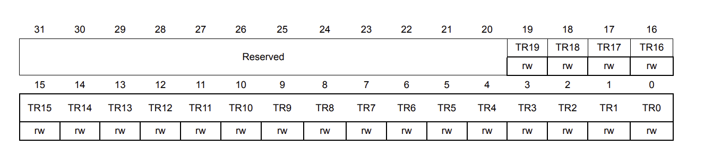
Dùng để bật mode Falling cho line bất kỳ
VD: Muốn dùng ngắt Rising cho line 0 thì phải set bit thứ 0 lên 1
```cpp
TR0 = 1
```
### 4. Pending register (EXTI_PR)
Bản chất khi một chân ngắt được detect, bit tương ứng với chân đó sẽ được set lên 1 trong thanh ghi này
Vì vậy để các ngắt khác có thể được thực thi, thì sau khi thực hiện ngắt hiện tại xong, chúng ta cần clear
bit tại thanh ghi này bằng cách write 1
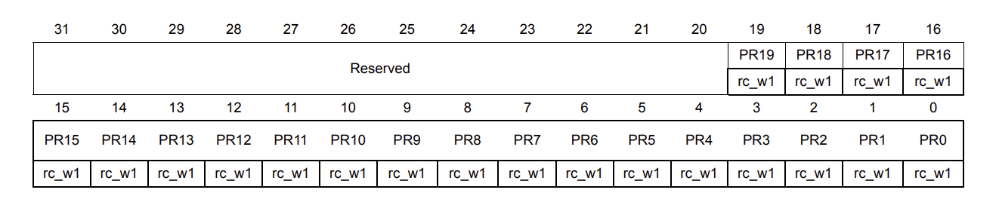


### NỘI DUNG

```cpp

Bài 1: KIẾN THỨC NỀN TẢNG
Bài 2: CHUYỂN BỊ TÀI LIỆU
Bài 3: DRIVER RCC
Bài 4: FUNCTION ENABLE 72MHZ, ENABLE PORT CLOCK
Bài 5: DRIVER GPIO
Bài 6: FUNCTION BLINK LED
Bài 7: DRIVER 
Bài 8:
Bài 9:

```
